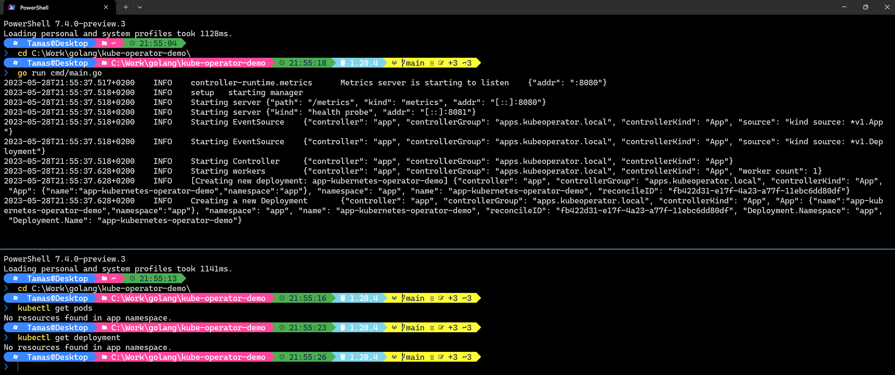
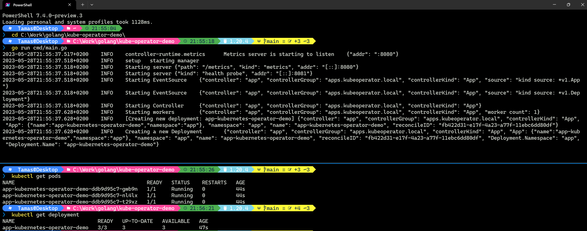

# Kubernetes operator demo

## Table of Contents
* [About](#about)
* [Quickstart](#quickstart)
* [Improvements](#improvements)
* [Notes](#notes)
* [How it's made](docs/HOWITSMADE.md)



## About
A custom controller written in Go, which extends the Kubernetes CRDs and control's the deployments of a given app.

Note: This code based on the `kubebuilder` template. 

## Quickstart
In order to build the controller/manager, it's recommended to use the `make` command
```shell
$ make
$ make install
```
This should also automatically apply the custom CRD resources to Kubernetes.
You can do this manually by:
```shell
kubectl apply -f config/crd/bases/apps.kubeoperator.local_apps.yaml
```

### Start the controller / manager
In order to run the application, simple use the command below, which will generate the necessary manifests and then uses the built-in go run command (`go run cmd/main.go`)
```shell
make run
```

Configuration for the sample nginx app:
```shell
kubectl apply -f config/samples/custom_v1_app.yaml
```

### Verify the pods / progress
```shell
kubectl get app -n <namespace>
kubectl get deployments -n <namespace>
kubectl get pods -n <namespace>
kubectl get svc -n <namespace>
kubectl get hpa -n <namespace>
```


## Improvements
- Ingress controller / Let's encrypt
Haven't really found a solution which synergies well with the current `kubebuilder` template without using `Helm`
- Secrets management: By using **[Mozilla Sops](https://github.com/mozilla/sops)** and **[Age](https://github.com/FiloSottile/age)** we should be able to generate secrets in a safer way. Sops supports a lot of encryption methods like: HasiCorp's Vault, GCP KMS, PGP, etc.; but **Age** is the most promising one in my opinion. 

## Notes


Let's talk about the elephant in the room (picture);
In 2023 still many dev tools are not platform-agnostic or simply behave differently on different OS.
- How some part of a make file still refuses the work properly
- or how the exact same code works perfectly one way [from Win or WSL] then later from the other terminal it causes the pods to stuck in `CrashLoop`. Not sure if the 2 environment fighting with each-other for the permissions, but often I had to delete the **kind/minikube** clusters to reset the strange behavior. 